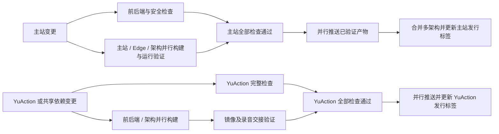

# CI/CD 工作流

主站与 YuAction 各自验证、各自发布。主站不等待不相关的 YuAction 检查；只有对应产品全部检查通过后，才授予发布任务 `packages: write` 并向 GHCR 推送镜像。

| 工作流 | 验证范围 | 发布镜像 |
| --- | --- | --- |
| `ci.yml` | 主站完整前端、后端 race、迁移、运维生命周期、安全扫描、主站及 Edge 镜像运行时 | DreamTrans、Edge |
| `yuaction.yml` | YuAction 完整前后端、数据库迁移、安装器、端口/持久化、录音蓝绿交接、安全扫描 | YuAction 后端、前端 |
| `docker-build.yml` | 仅由上述验证成功的工作流调用；校验并推送既有镜像产物 | 调用方所属产品 |



## 构建一次，验证后发布

- AMD64 使用 `ubuntu-24.04`，ARM64 使用原生 `ubuntu-24.04-arm`；组件和架构并行，BuildKit 缓存按组件及架构隔离。
- 构建时不登录注册表、不推送候选镜像。主站和 Edge 在原生 runner 上执行身份/启动检查；完整主站安装与恢复验证在 AMD64 执行。Edge 音频及重启验证覆盖两种架构。
- `docker save` 保存已验证镜像。产物记录提交、架构、镜像 ID 和归档 SHA-256。发布任务下载、校验并 `docker load`，确认与测试镜像身份一致，再直接 `docker push`，不重新编译。
- 每个产品的全部平台推送成功后，再创建多架构索引和发布清单，最后更新其 `latest`。主站的 `latest` 更新前，匹配的 Edge 索引已经存在。
- 关联安装仍可通过主站命令自动升级 YuAction，但现在解析 YuAction 自己的已验证 `latest`，并按该版本的 SHA 固定匹配前后端，不再要求与主站 SHA 相同。
- 临时镜像及平台摘要产物保留 1 天；过期后需要重新运行完整产品流水线。发行清单 `release-images-<产品>-<SHA>` 保留 30 天。

镜像身份由来源标签、镜像 ID 和归档校验值绑定。当前传输路径使用 Docker 单平台归档，不携带 BuildKit 的多平台 attestation 清单；不将它描述为已签名 provenance 或 SBOM。

实现依据：[Docker 跨任务传递镜像](https://docs.docker.com/build/ci/github-actions/share-image-jobs/)、[多平台构建](https://docs.docker.com/build/ci/github-actions/multi-platform/)。

## 触发与版本

`main` 推送、`v*` 标签、PR 和手动触发均保留。PR 完整验证，但不发布。主站忽略只修改 `yuaction/` 及其专属工作流的提交。YuAction 的路径过滤包括共享转录客户端、运维 CLI、部署协议及 Go 依赖文件；修改这些共享输入会触发两个产品。

路径清单在 `.github/ci-products.json`，镜像矩阵在 `.github/ci-images.json`。修改清单时同步工作流的路径过滤；契约测试会检查两者一致。需要等待 PR 检查的分支保护规则也应按各产品实际触发的工作流配置。

发布前检查远端主分支中该产品的内容是否仍与已验证提交一致。其他产品的新提交不会阻止本产品发布；存在更新的相关改动时保留 SHA 镜像，不移动浮动标签。

- 主站：`sha-<完整 SHA>`、`sha-<前 7 位>`，当前 main 发行版有 `main`、`latest`。
- Edge：`edge-<主站完整 SHA>`。
- YuAction 前后端：各自有相同的 `sha-<完整 YuAction SHA>` 和独立 `latest`。
- `v1.2.3` 生成 `1.2.3`、`1.2` 标签；预发布只更新完整预发布标签。Edge 继续按提交引用。

Event Worker 与 Provider 的独立工作流保留原有触发方式。

## 本地检查

前端使用 Node 24.18.0：

```bash
cd frontend
npm ci
npx playwright install --with-deps chromium
CI=true VITE_BACKEND_URL=/ VITE_BACKEND_WS_URL=/ npm run verify:ci
```

后端使用 Go 1.26.5，按 `ci.yml` 执行格式、模块、golangci-lint 2.12.2（`event_worker` 标签）、完整 race 与 event worker 测试。数据库迁移和数据库测试使用隔离的 pgvector PostgreSQL 16；镜像或运维修改还需运行相应生命周期与运行时检查。

工作流修改执行 actionlint 1.7.7（含 ShellCheck）和发布契约测试。主站与 YuAction 的检查范围为下列三个工作流；其他产品保持各自原有检查：

```bash
command -v shellcheck
go run github.com/rhysd/actionlint/cmd/actionlint@v1.7.7 .github/workflows/ci.yml .github/workflows/yuaction.yml .github/workflows/docker-build.yml
# 在已安装 PyYAML 6.0.2 的 Python 环境执行。
python3 -m unittest discover -s scripts/ci -p 'test_*.py' -v
```

全部修改结束后验证；验证后修改文件需重跑受影响检查。推送后确认该提交在对应产品流水线中的最终结果。
