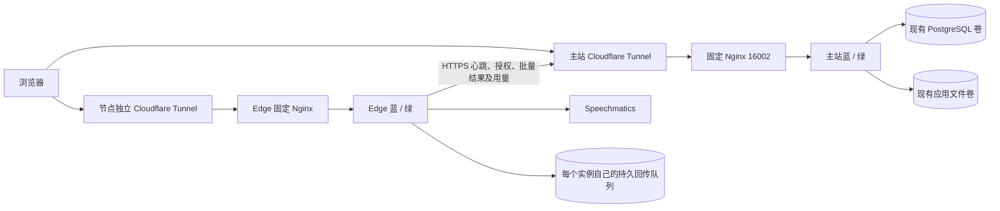

# 主站、区域 Edge 与蓝绿发布（开发预览）

本功能尚未完成生产验收。验证证据和未完成项见 [验证记录](../plans/regional-edge-validation.md)。以下命令用于隔离环境验证，不能将健康检查成功等同于生产验收完成。

## 数据与网络边界



主站维护用户、账户、额度预留、账本、节点、会话代次和历史。RAG、知识库、批处理与 YuAction 留在主站。Edge 不连接主站数据库，不加载主站 `rag.db`，不持有主站登录签名密钥或 Stripe 密钥。Edge 的 SQLite 仅用于该实例独占的回传队列，与主站历史 SQLite 无关。

每个可调度 Edge 必须使用独立入口域名和 Tunnel。浏览器探测节点入口延迟；主站将延迟与供应商握手延迟、负载、健康及容量一起评估，事务内确认分配。会话建立后固定节点。Edge 向主站发起 HTTPS 请求直接访问主站域名，不经过 Edge 自己的 Tunnel。

Cloudflare 官方说明：[独立 Tunnel 与负载均衡](https://developers.cloudflare.com/cloudflare-one/networks/connectors/cloudflare-tunnel/routing-to-tunnel/public-load-balancers/)、[WebSocket 连接可能中断](https://developers.cloudflare.com/network/websockets/)。

## 协议 v1 / v2

- 主站 `POST /api/edges/authorize` 校验用户归属、并发和余额；用户级 PostgreSQL 事务锁串行化授权，预算账本写入与会话写入在同一事务。
- 接入凭证为独立 Ed25519 签名，绑定用户、会话、节点、Origin、供应商、采样率、代次、额度和截止时间。浏览器通过 WebSocket 第一条 JSON 消息发送短期凭证；不将主站登录令牌发给 Edge，也不把凭证写入 URL。
- Edge 校验公钥签名和精确 Origin，并由主站原子消费接入凭证，拒绝重复连接。默认租约 45 秒，按 30 秒窗口预留预算；每 5 秒进行用量记录与续租，不在音频分片循环中同步访问主站。
- 音频采用 8 字节大端序号加 PCM f32le，支持 16 kHz、44.1 kHz、48 kHz。Edge 忽略已接收序号，拒绝跳号、超预算或超时继续发送。
- 结果/用量事件携带会话、代次、事件 UUID 和递增序号。主站约束幂等键及 payload hash，允许有界乱序，按连续前缀应用。相同事件键但不同内容被拒绝。
- `EdgeReceived` 仅表示节点收到音频。v2 的 `EdgeSaved.audio_sequence` 只覆盖主站已提交的供应商最终结果对应的完整音频帧；周期用量及异常断开不能推进该水位。浏览器保留最多 30 秒未确认音频，序号跨代次保持不变。页面刷新后缓冲丢失时明确要求新建录音，不伪装恢复成功。
- v2 仅对已提交最终结果确认的音频采样计费。异常退出的未完成尾部释放原预留，接管节点重放后在新代次计费；正常 EndOfTranscript 确认剩余静音采样。账本分别保存接收量、供应商调用量、批准预算及最终收费采样数。v1 继续使用原计费规则。新授权递增代次，旧代次写入被拒绝；冲突队列保留用于对账。
- 主站不可用时不批准新会话；已有会话受到原预算和租约约束。回传队列满时停止处理，保留未确认数据。跨节点重建供应商会话与重复音频计费的完整验收仍未完成。

本版同时实现 v1 和 v2。先升级 Edge，再升级主站；旧浏览器和旧主站继续使用 v1，新浏览器申请 v2，主站只选择支持该协议的节点。单个会话的协议不可中途更改。迁移 055 为扩展列，既有会话默认 v1，历史账本的收费采样回填为原消费量。升级发布控制器后，禁止回切到无法处理当前已授权协议的镜像；需要回切时使用仍支持 v1/v2 的兼容版本。

v2 的恢复粒度为完整音频帧：供应商的词时间戳是近似值，最后一个不足整帧的尾部可能重放，边界字幕仍须实测，不能宣称逐字无损去重。Edge 按供应商 AudioAdded 确认限流，最多提前发送 500 帧或 10 秒音频，等待不会阻塞主站控制面。依据 [Speechmatics WebSocket 协议](https://legacy.docs.speechmatics.com/en/real-time-appliance/api-v2/speech-api-guide/v4.0.0)。

## 首次主站转换

`3763a83` 及当前 `--update` 为原地升级。新增蓝绿入口为 `scripts/release.py`，不会把旧 `--update` 自动改为蓝绿。首次转换需要维护窗口，因为旧程序没有排空控制，也不能与新程序并行写入 SQLite。

发布控制器读取实际应用/数据库容器的环境、网络和挂载，保存到安装目录下权限为 0700 的 `.bluegreen`；状态和环境文件为 0600。要求原 `/app/data` 和 PostgreSQL 为现有普通本地命名卷。未知挂载或不匹配的数据标识会拒绝转换。

```bash
python3 scripts/release.py --dir /root/dreamtrans init \
  --app EXISTING_APP_CONTAINER --database EXISTING_POSTGRES_CONTAINER \
  --database-network EXISTING_SHARED_NETWORK \
  --image MAIN_REPOSITORY@sha256:RELEASE_DIGEST \
  --proxy-image NGINX_REPOSITORY@sha256:PROXY_DIGEST \
  --port 16002 --maintenance
```

必须把占位符替换为实际资源；不能照抄测试卷名称。转换保留原 `.env`、`compose.restore.yml`、`compose.production.yml`、external 应用卷和生产数据库卷，不重建 Compose 项目。迁移 053/054 为新增表、055 为恢复协议扩展；运行旧版本时只执行兼容扩展。停止旧写入后，以只读方式最终导入旧 SQLite 内容和配置，导入标记保证重复执行不会覆盖迁移后新写入。蓝绿实例改用 PostgreSQL RAG 和配置；知识库文件继续保存在原卷，不进行递归改权限。

首次交接 16002 会短暂中断。后续 Tunnel 始终连接固定代理。主站代理同时接入原数据库网络，提供稳定别名 `dreamtrans`；YuAction 保持原共享网络和 `YUFOLO_URL=http://dreamtrans:8080`，无需添加颜色容器地址或修改其 Compose 文件。容器重建后仍通过原网络连接固定代理。若该别名被其他运行容器占用，控制器拒绝交接，避免旧写入实例与代理产生歧义。

已用早期控制器完成转换的主站，先安装经过校验的新版宿主机 `release.py`，再执行以下命令补齐原网络入口。它仅连接代理网络，不重启主站、YuAction 或数据库，不更改现有路由和生产卷。原先手动为 YuAction 添加的入口网络可以保留，但后续重建不再依赖它。

```bash
python3 /root/dreamtrans/release.py --dir /root/dreamtrans sync-entry
```

新转换和后续发布会自动验证并补齐该连接；Docker 重启保留网络附件，控制器创建代理时也会重建附件。YuAction 安装器仍需按原顺序读取主站 `.env` 与其自身 `.env`，不要把数据库密码复制到子目录。现有 YuAction 更新器在找不到旧主站 Compose 应用容器时可能打印提示，但会保留已经配置的 `YUFOLO_URL`；入口继续由代理提供。

后台性能排查可运行 `python3 scripts/diagnose-performance.py --dir /root/dreamtrans`。
它只采集主机和容器资源、固定入口的本机延迟、数据库等待、表统计及现有索引，
不输出运行中的 SQL 文本、账户内容或配置密钥，也不执行建索引、ANALYZE 或重启。
本机健康接口延迟不能代表浏览器或后台业务接口耗时；EC2 积分历史仍需从监控中核对。

## 主站发布与回切

```bash
python3 scripts/release.py --dir /root/dreamtrans status
python3 scripts/release.py --dir /root/dreamtrans deploy --image MAIN_REPOSITORY@sha256:RELEASE_DIGEST
python3 scripts/release.py --dir /root/dreamtrans drain
python3 scripts/release.py --dir /root/dreamtrans resume
python3 scripts/release.py --dir /root/dreamtrans abort # 仅切流前中止候选
python3 scripts/release.py --dir /root/dreamtrans rollback
```

发布检查不可变镜像、内存余量、兼容性清单、已应用迁移校验和，再启动候选实例。候选默认不接业务和后台任务；通过就绪/功能检查后切代理。进度显示各阶段、内存和排空计数。`--pause` 可停在候选阶段；`abort` 可中止尚未切流的失败候选。候选已崩溃时，Edge 以独占锁和只读查询检查回传队列；非空、损坏或被占用时拒绝复用。排空超时保留旧实例，不强制结束转录。

Nginx 平滑重载让旧 worker 继续处理已有连接，见 [Nginx 官方控制说明](https://nginx.org/en/docs/control.html)。应用自身仍须拒绝新工作并持续统计旧工作。长连接、未完成任务、未确认队列未清零时不得停止旧版。

控制器以宿主机锁防并发，以原子文件记录切流意图。中断恢复复用匹配镜像和卷的实例。回切只切兼容镜像，不撤销迁移、不恢复数据库旧快照、不删除新数据。已转换后不能回切到仍写 SQLite 的旧镜像。

## Edge 安装和运维

测试拓扑采用 1 台 EC2 主站（Ubuntu 26.04、t3.medium、60 GiB gp3）及 2 台 Lightsail Edge（东京/法兰克福，先使用 1 GB 套餐做低并发验收、Ubuntu 24.04 或 26.04、带公网 IPv4）。每个实例使用独立测试域名与 Tunnel。Edge 发布清单独立于主站，候选实例启动前要求至少 384 MiB 可用内存；每个 Edge 应用容器限制为 256 MiB（禁用额外 swap），两颜色合计最多 512 MiB，另须为 OS、Docker、代理与 Tunnel 留空间。实际 1 GB 主机容量与持续蓝绿运行必须以实机测试为准。

主站启用区域功能需要独立 `EDGE_SIGNING_SEED`（32 字节随机值的 raw base64）；配置 `APP_BASE_URL`、`EDGE_RELEASE_IMAGE`、`EDGE_PROXY_IMAGE` 为正确 HTTPS 主站与不可变镜像。可选 `EDGE_CLOUDFLARED_IMAGE`。这些设置必须在应用环境中生效，不能误写到 Edge。

管理员节点页面创建节点，获得 15 分钟注册凭证与安装命令。注册凭证、供应商独立密钥通过隐藏输入或受保护文件传入。命令验证下载脚本 SHA-256，再从不可变镜像提取控制器。Edge 自动安装依赖支持 Ubuntu 24.04/26.04，以兼容 Lightsail 官方 Ubuntu 24 蓝图；主站仍须完成 Ubuntu 26.04 EC2 实机验证。

```bash
python3 /opt/dreamtrans-edge/edge-install.py status
python3 /opt/dreamtrans-edge/edge-install.py logs
python3 /opt/dreamtrans-edge/edge-install.py diagnose
python3 /opt/dreamtrans-edge/edge-install.py drain
python3 /opt/dreamtrans-edge/edge-install.py --image EDGE_REPOSITORY@sha256:RELEASE_DIGEST upgrade
python3 /opt/dreamtrans-edge/edge-install.py rollback
python3 /opt/dreamtrans-edge/edge-install.py abort # 仅切流前中止候选
python3 /opt/dreamtrans-edge/edge-install.py pause-releases
python3 /opt/dreamtrans-edge/edge-install.py resume-releases
python3 /opt/dreamtrans-edge/edge-install.py uninstall
```

非默认目录需加 `--dir`。卸载先停止调度，确认连接和回传队列排空，撤销身份后移除容器；保留配置和审计目录。未知或冲突队列不会自动删除，需先完成对账处置。

可在主站配置受限 `EDGE_CLOUDFLARE_API_TOKEN`、`EDGE_CLOUDFLARE_ACCOUNT_ID`、`EDGE_CLOUDFLARE_ZONE_ID`、`EDGE_CLOUDFLARE_ZONE_NAME`，自动创建节点 Tunnel/DNS；账户凭证留在主站，仅下发节点 token。已有 DNS 指向不符时拒绝覆盖。也支持 API 提供已有节点专用 token。凭证轮换、部分安装恢复和远端自动发布仍需完整生命周期验收。

通过 `ci.yml` 的手动运行可以为指定分支发行验证后的镜像；工作流输出 `release-images-<commit>` 清单，包含主站与 Edge 的不可变 digest。Edge 标签为 `edge-<完整提交号>`，安装配置始终使用清单中的 digest。非默认分支的发行不会更新主站 `latest`。

## 备份与恢复边界

现有 R2 备份保留。新增全量快照包含 PostgreSQL dump、实际应用卷文件、Compose 叠加配置与发布状态，并记录哈希和实际卷标识；备份期间阻止知识文件物理删除，数据库备份前后应用仍可写入新数据。备份输出含密钥，必须沿用加密上传，不得当普通日志分享。

数据库备份不等于完整应用备份。Edge 每颜色回传队列单独保留，不并写、不覆盖、不随镜像清理。全量快照及 R2 加密上传/下载、隔离恢复和损坏校验已经在测试环境执行，详见验证记录。旧代次队列按下文的归档确认流程处理，无法证明归属或内容冲突的记录继续保留。

## 被拒绝的旧代次事件与排空

迁移 `056_edge_fenced_archive.sql` 增加每代节点归属和归档表；数据库触发器也为滚动升级中的旧主站记录归属。已结算的旧代次仍不能写入当前历史或账本，但原节点可向 `POST /api/edge-control/archive` 提交保留的事件。主站事务提交后返回会话、代次、序号、事件编号、内容哈希和归档类别。Edge 逐条核对回执后释放本地记录；此回执不发送 `EdgeSaved`，不推进音频持久化水位，不重复扣费。主站不可用、所有权未知或内容冲突时继续保留队列；单代失败退避，不阻塞其他代次对账。归档随主站 PostgreSQL 备份保存。

已经运行旧 Edge、因被拒绝事件无法排空的节点，可安装同一已校验发行包中的新版生命周期脚本后执行：

```bash
sudo python3 /opt/dreamtrans-edge/edge-install.py reconcile
sudo python3 /opt/dreamtrans-edge/edge-install.py status
```

命令先持久化关闭调度和新连接；存在活跃连接、HTTP 请求或任务时拒绝继续，不按固定时间强杀转录。仅在工作计数为零后关闭旧版空闲进程，独占其 `owner.lock`，校验 SQLite 并创建权限为 0600 的一致性备份。每条记录必须收到匹配的主站归档确认才删除。进程重启策略和需恢复的容器在操作前写入发布状态；中断后再次执行 `reconcile` 可继续，已确认记录不会重复入账。自动发布在待恢复期间暂停。完成后恢复原来运行的实例，节点保持排空，管理员检查后重新启用调度。不要手动删除 `outbox.db`；`reconciliation-audit` 备份按含转录数据的敏感备份管理，确认主站恢复副本可用后再按保留策略安全删除。

对于迁移前已经发生接管、数据库没有原代次归属的历史记录，必须根据原始接管日志和受保护的队列备份核实节点。超级管理员通过 `POST /api/admin/edges/{node}/archive-owner` 提交 `session_id`、`generation` 和 `reason`（证据引用），记录审计后才能归档；不能从当前节点推断旧节点，也不能覆盖已有归属。此操作不能恢复旧节点的写权限。缺失会话、内容冲突或无法证明归属的记录保留，需人工处理。

每条 Edge 转录退出日志记录会话、代次、首个退出原因、WebSocket 关闭码、是否超时、采样与分片数量，不记录授权、供应商错误原文或音频。`client_read_failed` / 1006 表示接入连接非正常结束，不能仅凭此码断言是 Cloudflare、浏览器或某一网络设备造成；需结合浏览器和链路记录。验收应检查同一会话的新代次续传和最终账本，而不能以重试后某一轮成功证明故障不会再发生。
